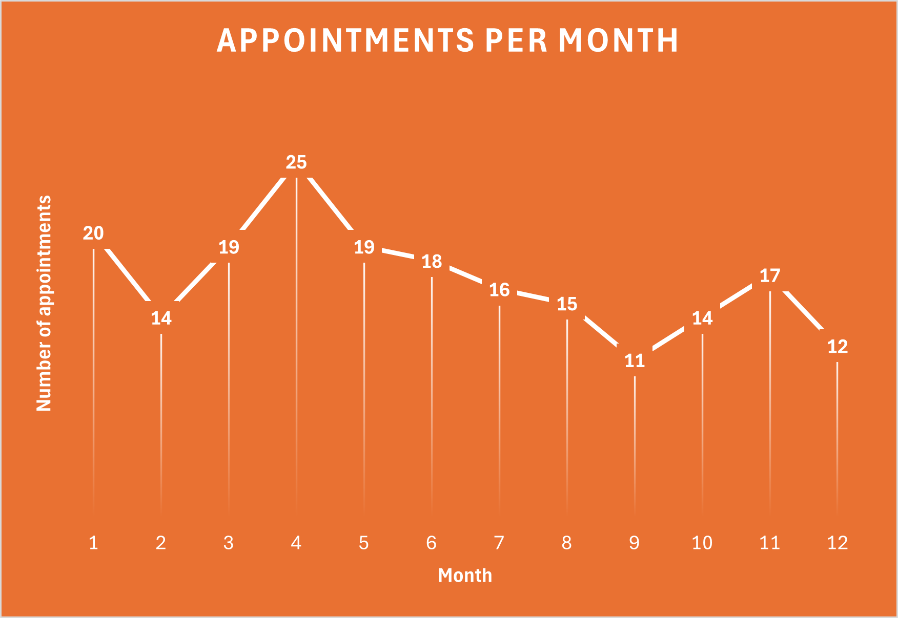
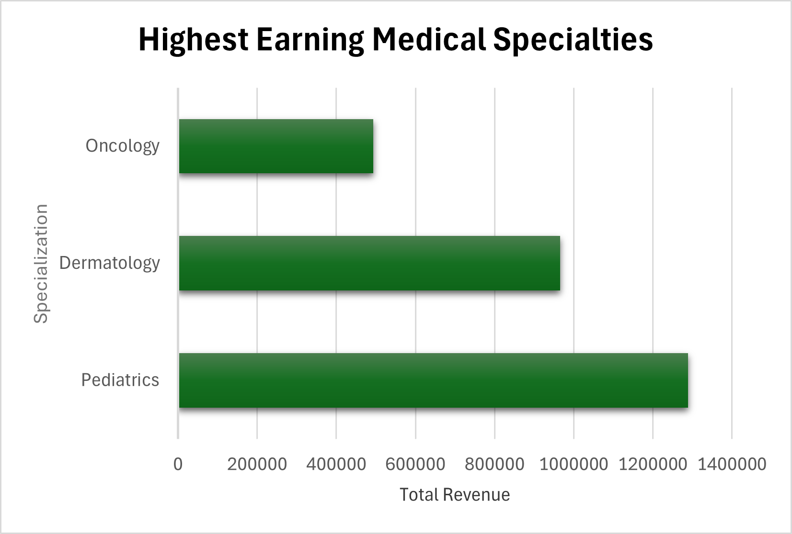
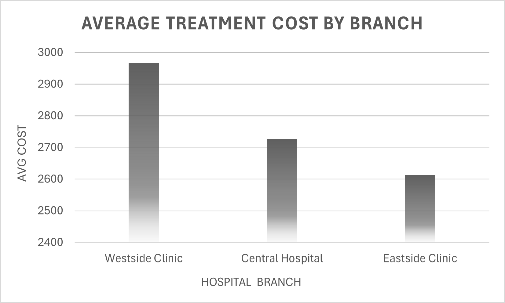
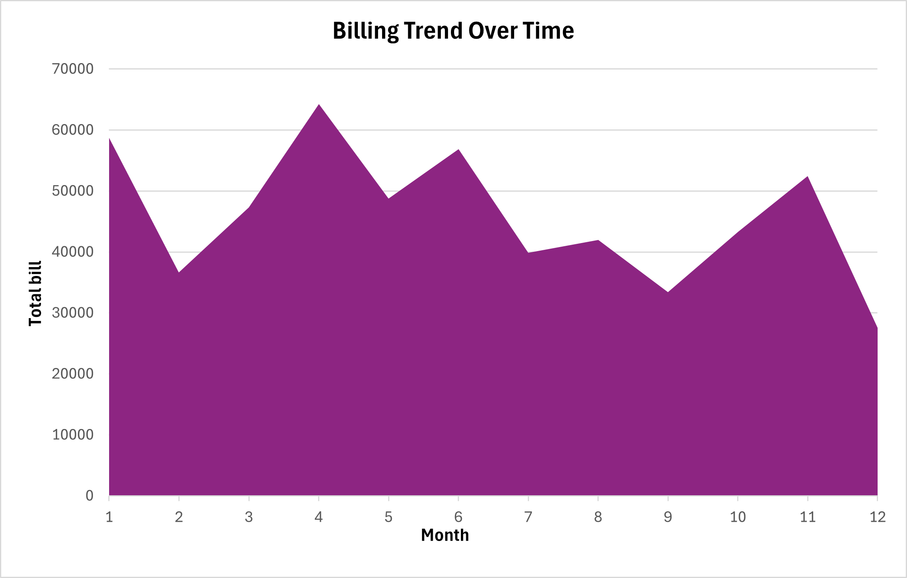
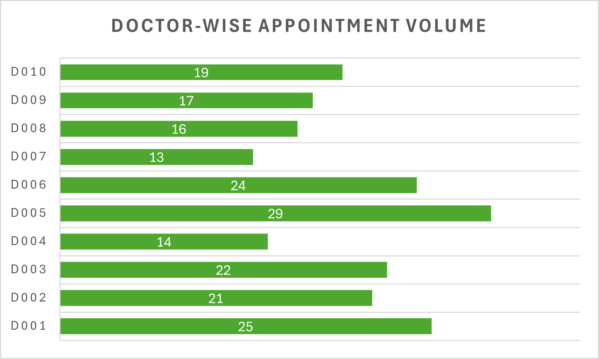
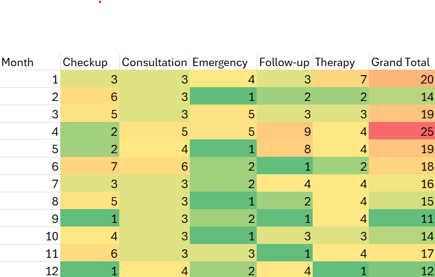
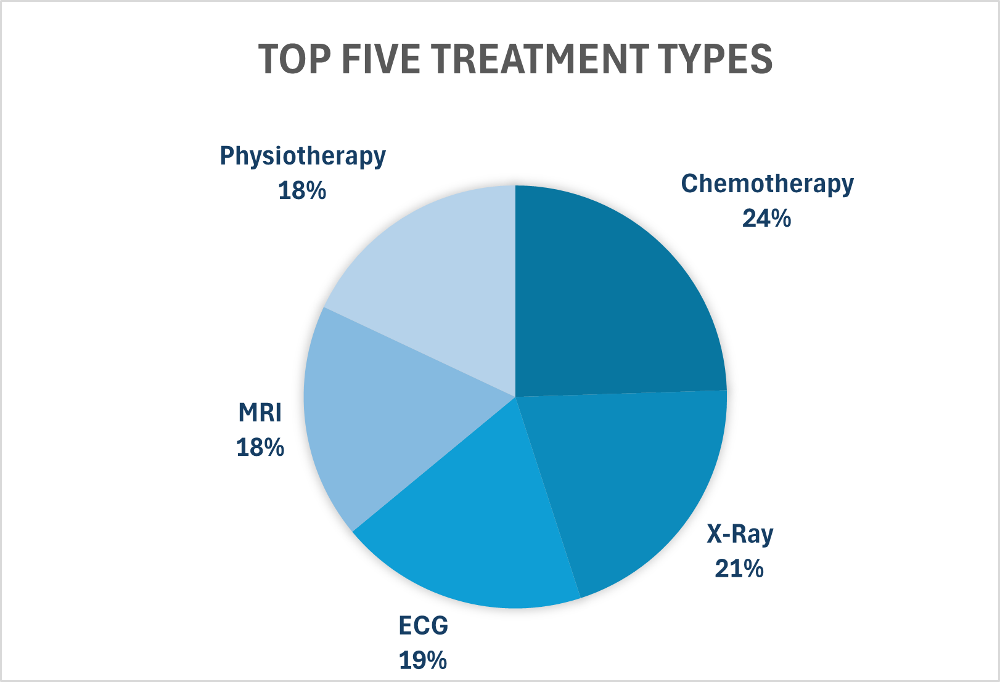
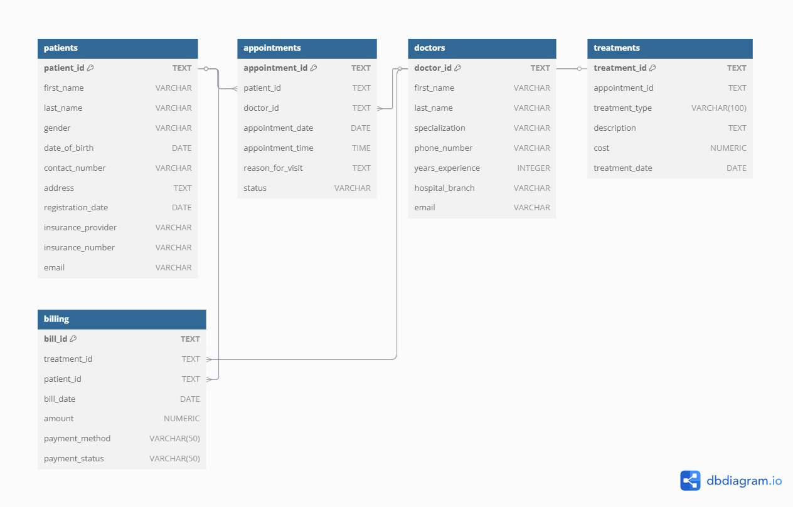

#  Hospital Management System – SQL Analysis Project

##  Project Overview

This project explores a relational hospital management database that simulates core healthcare operations. It features key entities such as **patients**, **doctors**, **appointments**, **treatments**, and **billing**. The analysis demonstrates advanced SQL skills including joins, subqueries, aggregations, and time-based metrics applicable to real-world hospital systems.

---

##  Database Schema

This relational schema includes five interconnected tables:

<details>
<summary><strong>patients</strong></summary>

| Column               | Type         | Description                        |
|----------------------|--------------|------------------------------------|
| patient_id           | TEXT         | Unique patient ID                  |
| first_name, last_name| VARCHAR(50)  | Patient name                       |
| gender               | VARCHAR(10)  | Gender                             |
| date_of_birth        | DATE         | Birth date                         |
| contact_number       | VARCHAR(20)  | Phone number                       |
| address              | TEXT         | Home address                       |
| registration_date    | DATE         | Registration date in hospital      |
| insurance_provider   | VARCHAR(100) | Insurance company                  |
| insurance_number     | VARCHAR(50)  | Policy ID                          |
| email                | VARCHAR(100) | Email address                      |
</details>

<details>
<summary><strong> doctors</strong></summary>

| Column             | Type         | Description                    |
|--------------------|--------------|--------------------------------|
| doctor_id          | TEXT         | Unique ID                      |
| first_name         | VARCHAR(50)  | Doctor's first name            |
| last_name          | VARCHAR(50)  | Doctor's last name             | 
| specialization     | VARCHAR(100) | Medical specialty              |
| phone_number       | VARCHAR(20)  | Contact number                 |
| years_experience   | INTEGER      | Years of experience            |
| hospital_branch    | VARCHAR(100) | Hospital location              |
| email              | VARCHAR(100) | Email address                  |
</details>

<details>
<summary><strong> appointments</strong></summary>

| Column             | Type        | Description                            |
|--------------------|-------------|----------------------------------------|
| appointment_id     | TEXT        | Unique ID                              |
| patient_id         | TEXT        | Foreign keys                           |
| doctor_id          | TEXT        | Foreign keys                           |
| appointment_date   | DATE        | Date of appointment                    |
| appointment_time   | TIME        | Time of appointment                    |
| reason_for_visit   | TEXT        | Reason stated by patient               |
| status             | VARCHAR(50) | Scheduled, Completed, Cancelled, etc.  |
</details>

<details>
<summary><strong> treatments</strong></summary>

| Column           | Type         | Description                          |
|------------------|--------------|--------------------------------------|
| treatment_id     | TEXT         | Unique ID                            |
| appointment_id   | TEXT         | Related appointment                  |
| treatment_type   | VARCHAR(100) | Type (e.g., X-ray, MRI)              |
| description      | TEXT         | Treatment notes                      |
| cost             | NUMERIC      | Cost of treatment                    |
| treatment_date   | DATE         | Date provided                        |
</details>

<details>
<summary><strong> billing</strong></summary>

| Column           | Type         | Description                       |
|------------------|--------------|-----------------------------------|
| bill_id          | TEXT         | Unique ID                         |
| patient_id       | TEXT         | Refers to patient                 |
| treatment_id     | TEXT         | Refers to treatment               |
| bill_date        | DATE         | Billing date                      |
| amount           | NUMERIC      | Total billed amount               |
| payment_method   | VARCHAR(50)  | Cash, Card, Insurance, etc.       |
| payment_status   | VARCHAR(50)  | Paid, Pending, Failed             |
</details>

---

## Key Insights & Metrics

### General Insights

- **Dr. Sarah Taylor (D005)** had the highest appointments (18) and treatments (29).
- **48 patients** visited multiple doctors (suggesting referrals).
- **P012** had the highest billing: **$30,053.08**.

### Subqueries & Aggregates

- **Top 5 treatments:** Chemotherapy, X-Ray, ECG, MRI, Physiotherapy.
- **44 patients** spent more than \$5000.
- **All doctors** treated >10 patients; 2 patients were never billed.

### Time-Based Trends

- **April** had the highest number of appointments and billing.
- **Checkups and Follow-ups** were most frequent.
- Monthly spikes:
  - **April (M4):** 9 Follow-ups
  - **May (M5):** Highest overall treatment load
  - **June (M6):** Peak in Consultations

### Advanced Metrics

- **Top revenue-generating specializations:**
  1. Pediatrics – \$1,289,294.61  
  2. Dermatology – \$965,566.84  
  3. Oncology – \$493,428.71  
- **Most expensive hospital branch:** *Westside Clinic* (avg. \$2966.28)
- **Doctor with highest avg. cost:** *D008* (\$3339.21)

---

## Sample Queries

```sql
-- Appointments per doctor
SELECT doctor_id, COUNT(*) AS total_appointments
FROM appointments
GROUP BY doctor_id;
```

```sql
-- Top 5 treatment types
SELECT treatment_type, COUNT(*)
FROM treatments
GROUP BY treatment_type
ORDER BY COUNT(*) DESC
LIMIT 5;
```

---

## Visualizations
  










  




---

## Tools Used

- **PostgreSQL (pgAdmin4)**
- **SQL** (Joins, subqueries, window functions, aggregations)
- **Kaggle Hospital Management Dataset**
- **Excel / Python (optional for visuals)**

---

## Author

**Mahwish Malik**  
*Master’s Student – Health Informatics*  
Passionate about healthcare analytics, EMR systems, and SQL-based clinical data modeling.

---

